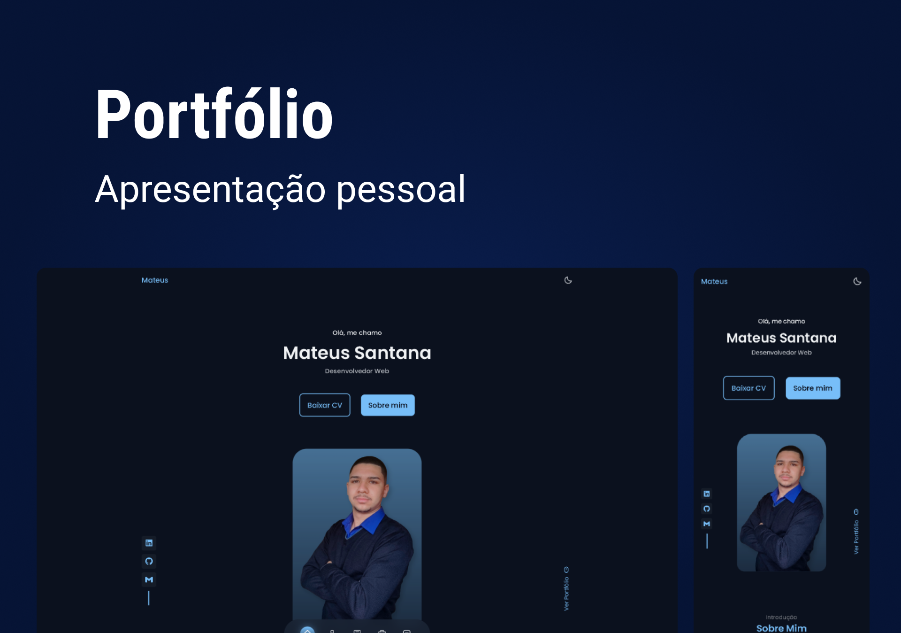

# Portfólio

Site pessoal utilizado para listar e apresentar informações necessárias sobre mim, dentre elas estão as tecnologias que possuo alguma habilidade, o que posso oferecer, meus projetos para serem consultados e muito mais.

<div align="center">
    
</div>

## 🚀 Tecnologias

Esse projeto foi desenvolvido com as seguintes tecnologias:

- HTML
- CSS
- [TypeScript](https://www.typescriptlang.org/)
- [NodeJS](https://nodejs.org/en/)
- [EJS](https://ejs.co)
- [Express](https://www.npmjs.com/package/express)

## 💻 Acesse o projeto online

- [https://mateussantana.onrender.com/](https://mateussantana.onrender.com/)

## 💻 Acesse o projeto local

### :white_check_mark: Requisitos ###

Antes de começar :checkered_flag:, você precisa ter o [Git](https://git-scm.com) e o [Node](https://nodejs.org/en/) instalados.

### :checkered_flag: Começo ###

```bash
# Clone o projeto
$ git clone https://github.com/mateussantanasilva/Portfolio.git

# Acesse
$ cd Portfolio/

# Instale as dependências
$ npm install

# Altere o caminho das views
# no arquivo server.ts, altere a chamada views '../src/views' para 'views'

# Execute o projeto
$ npm run dev

# O servidor será inicializado e poderá ser acessado por: <http://localhost:3000>
# Caso a porta esteja ocupada, vá até src/server.ts e altere a porta para uma livre.
```
#### Variáveis locais
No arquivo .env, será necessário possuir as seguintes informações:
- CLIENT_ID
- SECRET_KEY
- REFRESH_TOKEN
- USER_AGENT
- TOKEN_USER_GITHUB
